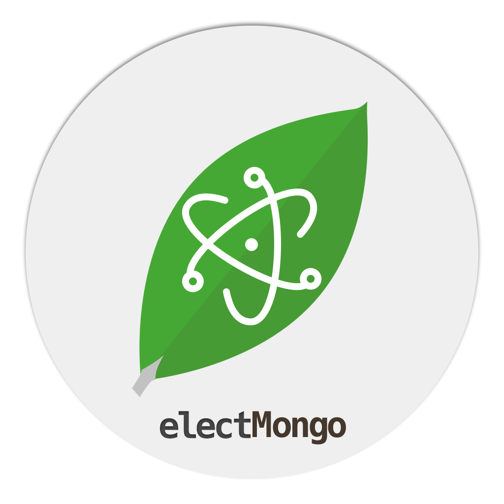

ElectMongo 
--

Free open source cross platform MongoDB console written in Node.js Ellectron.

You can build it yourself and execute in seconds!

### Build & Use:

We use electron-packager to build the binary.

>Optionally, we host our official app on AppStore and Window store.
You can download them and enjoy automatically update. 

```
//macOS
npm run build-osx

//linux
npm run build-linux

//Windows
npm run build-windows

// All
npm run build-all

```

After build, go to the ./bin folder and choose platform you build then exec!

### Roadmap :

* 0.2.* : User Management,
        Multiple connection

* 0.1.* : 
    
    * User Guide
    * Test Code
    * Add collection
    * Add document "field"
    * Remove document
    * Add document

        ***CURRENT***

    * 0.1.1.5 : save edited documents

    * 0.1.1.4 : edit documents(text base)

    * 0.1.1.3 : show documents in table (Use md-virtual-repeat to ensure performance)

    * 0.1.1.2 : show collections' documents

    * 0.1.1 : show db collections, execute command

    * 0.1.0 : basic connect

### Discussion :

* 0.1 
    * How we deal with?
        * MongoDB is a document base database, should we use a document editor or a schema format to represent and edit the datas?


license : MIT
```
Copyright (c) 2016 Matthew Lui

Permission is hereby granted, free of charge, to any person obtaining a copy of this
software and associated documentation files (the "Software"), to deal in the Software 
without restriction, including without limitation the rights to use, copy, modify, 
merge, publish, distribute, sublicense, and/or sell copies of the Software, and to 
permit persons to whom the Software is furnished to do so, subject to the following 
conditions:

The above copyright notice and this permission notice shall be included in all copies 
or substantial portions of the Software.

THE SOFTWARE IS PROVIDED "AS IS", WITHOUT WARRANTY OF ANY KIND, EXPRESS OR IMPLIED, 
INCLUDING BUT NOT LIMITED TO THE WARRANTIES OF MERCHANTABILITY, FITNESS FOR A 
PARTICULAR PURPOSE AND NONINFRINGEMENT. IN NO EVENT SHALL THE AUTHORS OR COPYRIGHT 
HOLDERS BE LIABLE FOR ANY CLAIM, DAMAGES OR OTHER LIABILITY, WHETHER IN AN ACTION OF 
CONTRACT, TORT OR OTHERWISE, ARISING FROM, OUT OF OR IN CONNECTION WITH THE SOFTWARE 
OR THE USE OR OTHER DEALINGS IN THE SOFTWARE.
```